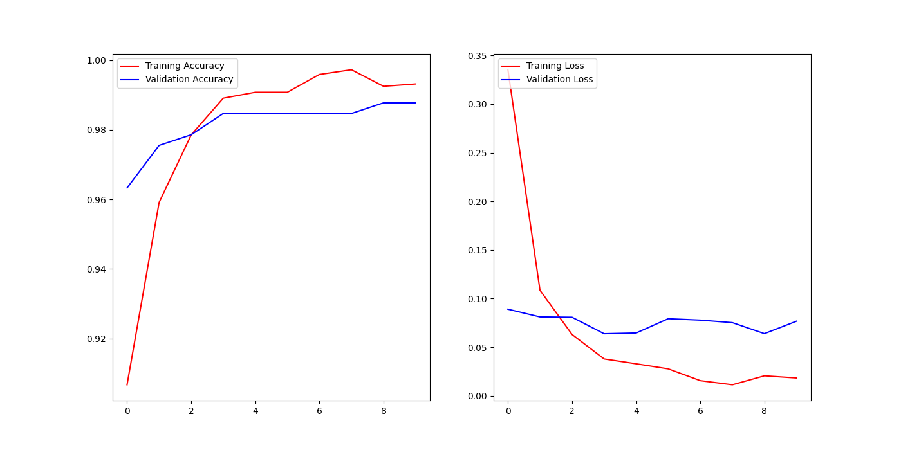

# 🧠 Beyin Tümörü Tespit Sistemi

Bu proje, derin öğrenme modellerini kullanarak MRI görüntülerinden beyin tümörlerini tespit etmek için web tabanlı bir uygulama sunmaktadır. Sistem, arka uç için Flask'ı ve tahminler için eğitilmiş bir Keras modelini kullanırken, HTML, CSS ve JavaScript ile oluşturulmuş kullanıcı dostu bir ön yüze sahiptir.

## ✨ Özellikler

* **Görüntü Yükleme:** Kullanıcılar MRI görüntülerini sürükle ve bırak veya dosya seçimi yoluyla yükleyebilirler.
* **Gerçek Zamanlı Tahmin:** Yüklenen görüntü, anında beyin tümörü tespiti için arka uç Flask API'sine gönderilir.
* **Tahmin Gösterimi:** Uygulama, yüklenen görüntüyle birlikte bir tümörün tespit edilip edilmediğini ("Tümör") veya edilmediğini ("Tümör Yok") gösterir.
* **Derin Öğrenme Modelleri:** Hem özel bir Evrişimli Sinir Ağı (CNN) hem de ResNet50 tabanlı bir transfer öğrenme modeli eğitmek için betikler içerir.

## 📊 Model Performansı

`app.py`'de çıkarım için kullanılan birincil model, sağlanan betiklerden biri kullanılarak eğitilmiştir (büyük olasılıkla grafikten anlaşıldığı üzere `CustomCNNmodel.py`).

Eğitim görselleştirmesine (`Figure_1.png`) göre:
* **Eğitim Doğruluğu:** Yaklaşık olarak **%99.5**'e ulaşır.
* **Doğrulama Doğruluğu:** Yaklaşık **%98.5-99** civarında stabilize olur.
* **Eğitim Kaybı:** Çok düşük değerlere, **0.01**'e yakın düşer.
* **Doğrulama Kaybı:** Yaklaşık **0.07** civarında sabitlenir.



## 🛠️ Kurulum

Bu projeyi yerel olarak kurmak ve çalıştırmak için aşağıdaki adımları izleyin:

### 1. Depoyu Klonlayın

```bash
git clone [https://github.com/kullaniciadiniz/beyin-tumoru-tespit.git](https://github.com/kullaniciadiniz/beyin-tumoru-tespit.git)
cd beyin-tumoru-tespit
